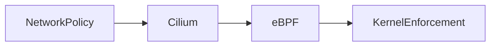
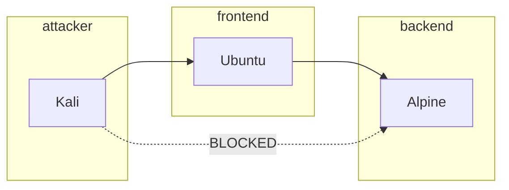

# ⚔️ Heimdall

### eBPF-Powered Kubernetes Security & Observability Platform

---

## 🧠 Overview

**Heimdall** is a cloud-native security and observability system built using **Kubernetes + eBPF**, designed to provide deep visibility, fine-grained control, and intelligent analysis of network traffic in containerized environments.

Inspired by **Heimdall — the all-seeing guardian in Norse mythology**, this project aims to:

> 👁️ Observe everything
> 🔐 Enforce security intelligently
> 🌐 Control traffic flow
> 🧠 Understand relationships between services

---

## 🎯 Problem Statement

Modern containerized environments suffer from:

* ❌ Lack of visibility into service-to-service communication
* ❌ Static and coarse-grained security policies
* ❌ Difficulty detecting attacks (DDoS, SYN flood, DNS abuse)
* ❌ Fragmented tooling for networking, security, and observability

Heimdall solves this by creating a **unified platform**.

---

## ⚙️ Core Idea

Heimdall operates at the **kernel level using eBPF** while integrating with **Kubernetes as the control plane**.



---

## 🏗️ Architecture

Heimdall is modular:

| Module          | Name          | Responsibility           |
| --------------- | ------------- | ------------------------ |
| 👁️ Monitoring  | Heimdall Core | Traffic visibility       |
| 🔐 Security     | Aegis         | Policy enforcement       |
| 🌉 Networking   | Bifrost       | Routing & load balancing |
| 🌳 Intelligence | Yggdrasil     | Graph + clustering       |
| 🚨 Alerts       | Gjallarhorn   | Detection & response     |

---

## 🧪 Lab Topology (Phase 1)

We simulate a real environment using Kubernetes:



### Roles:

| Component  | Purpose             |
| ---------- | ------------------- |
| 🐱‍💻 Kali | Attacker simulation |
| 🐧 Ubuntu  | Frontend service    |
| 🏔️ Alpine | Backend service     |

---

## 🔐 Network Policy (Zero Trust)

We enforce:

* ✅ Frontend → Backend allowed
* ❌ Attacker → Backend blocked
* ✅ Attacker → Frontend allowed

This is implemented using **Kubernetes NetworkPolicy + Cilium (eBPF)**.

---

## 📁 Project Structure

```text
heimdall/
│
├── k8s/
│   ├── base/
│   │   ├── namespaces.yaml
│   │   ├── deployments.yaml
│   │   ├── services.yaml
│   │
│   ├── policies/
│   │   ├── network-policy.yaml
│   │
│   ├── heimdall/              # future agent deployment
│
├── agent/                    # Heimdall logic (Python)
├── ebpf/                     # eBPF programs (C)
├── docker/                   # Dockerfiles
├── scripts/                  # automation
├── docs/                     # detailed docs
│
├── README.md
└── .gitignore
```

---

## 🚀 Getting Started

### 1️⃣ Start Kubernetes (with eBPF support)

```bash
minikube start --cni=cilium
```

---

### 2️⃣ Deploy Heimdall Phase 1

```bash
./scripts/deploy.sh
```

---

### 3️⃣ Verify

```bash
kubectl get pods -A
kubectl get svc -A
```

---

### 4️⃣ Test Connectivity

Enter attacker pod:

```bash
kubectl exec -n attacker -it deploy/kali-deploy -- bash
```

Install curl:

```bash
apt update && apt install curl -y
```

---

### Test frontend:

```bash
curl ubuntu-service.frontend
```

---

### Test backend (should FAIL):

```bash
curl alpine-service.backend
```

---

## 🧠 Key Learnings

* Kubernetes networking is **plugin-based (CNI)**
* NetworkPolicy requires enforcement (Cilium/Calico)
* eBPF enables **kernel-level control and visibility**
* Micro-segmentation = **modern zero-trust security**

---

## 🔥 Current Features

* ✅ Multi-namespace Kubernetes topology
* ✅ Service-to-service communication
* ✅ Network policy enforcement (Cilium)
* ✅ Zero-trust isolation

---

## 🚀 Roadmap

### Phase 2 — Heimdall Core

* eBPF packet monitoring
* Flow logging (src → dst → protocol)

### Phase 3 — Aegis

* Dynamic rule enforcement
* Rate limiting
* Attack detection

### Phase 4 — Bifrost

* Traffic routing
* Load balancing

### Phase 5 — Yggdrasil

* Graph generation
* Service relationship mapping

### Phase 6 — Gjallarhorn

* Alerting engine
* Automated response

---

## ⚔️ Vision

Heimdall aims to become:

> A **unified, intelligent networking + security layer** for Kubernetes

---

## 🤝 Contributing

This is an evolving system. Contributions, ideas, and improvements are welcome.

---

## 🧠 Final Thought

> “Heimdall sees all — and now, so will you.”
