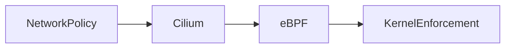

# ⚔️ Heimdall

Heimdall is an eBPF-powered Kubernetes security and observability platform.

It provides:
- Deep network visibility
- Fine-grained policy enforcement
- Traffic monitoring and analysis

---

## 🧠 Architecture

chmod +x scripts/deploy.sh