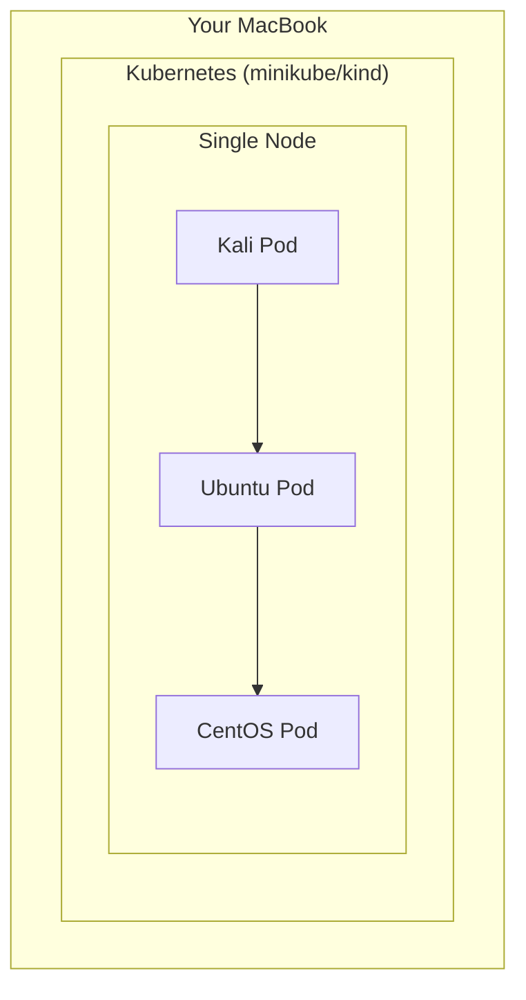
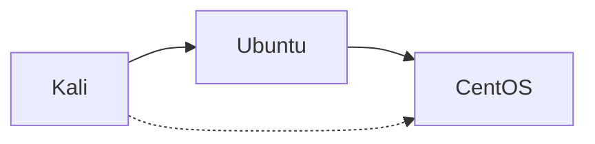
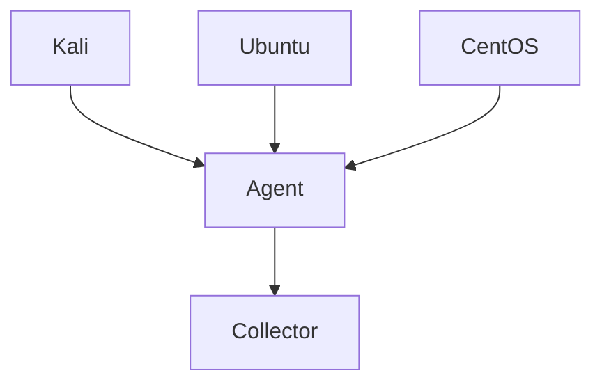

# ⚔️ Heimdall — An eBPF-Powered Kubernetes Security & Observability Platform

## 🚀 Introduction

Modern cloud-native systems are **dynamic, distributed, and complex**. Containers spin up and down, services communicate across clusters, and traditional security tools often struggle to keep up with this level of abstraction and speed.

**Heimdall** is designed to solve this problem.

Inspired by **Heimdall from Norse mythology — the all-seeing guardian**, this project aims to build a **kernel-level observability and security platform** using **eBPF** and **Kubernetes**, capable of monitoring, controlling, and securing network traffic across containerized environments.

---

## 🧠 Vision

Heimdall acts as an **intelligent control layer over Kubernetes networking**, providing:

* 👁️ Deep visibility into all network traffic
* 🔐 Fine-grained security enforcement
* 🌐 Intelligent traffic routing and control
* 🌳 Graph-based relationship mapping between services
* 🚨 Real-time alerting and automated response

All of this is achieved with **minimal user effort**, where complexity is handled internally and users interact through **simple configurations (YAML)**.

---

## 🧩 Problem Statement

In a typical containerized environment:

* You **cannot easily see** who is talking to whom
* Security rules are often **static and coarse-grained**
* Detecting attacks like **DDoS, SYN floods, or DNS abuse** is difficult
* Understanding **service relationships** requires heavy tooling
* Networking and security are handled by **separate systems**

Heimdall aims to unify all of this into **one cohesive platform**.

---

## ⚙️ Core Idea

Heimdall integrates tightly with Kubernetes and operates at the **kernel level using eBPF**, enabling it to:

* Observe traffic **without modifying applications**
* Enforce policies **in real-time**
* Analyze behavior **with near-zero overhead**

---

## 🏗️ High-Level Architecture

Heimdall is built as a **modular system**, where each component has a distinct responsibility:

* **Heimdall Core** → Visibility and monitoring
* **Aegis** → Security and policy enforcement
* **Bifrost** → Networking and traffic routing
* **Yggdrasil** → Graph and relationship engine
* **Gjallarhorn** → Alerts and response system

These modules work together to provide a **complete network intelligence platform**.

---

# 🧠 🎯 Goal

Run:

* 🐧 Ubuntu → *service*
* 🐉 CentOS → *backend*
* 🐱‍💻 Kali → *attacker*

All:

* managed by **Kubernetes**
* isolated logically
* observable by **Heimdall later**

---

# 🏗️ 🧱 Your Local Topology

👉 Since you’re on a Mac:

* You’ll start with **1 node cluster**
* That’s totally fine for MVP

---

# 🧩 🧠 Logical Isolation (IMPORTANT)

We won’t isolate by VM — we’ll isolate by **Kubernetes concepts**

---

## 🔹 Option 1 (BEST FOR YOU): Namespaces

| Pod    | Namespace  | Purpose          |
| ------ | ---------- | ---------------- |
| Kali   | `attacker` | simulate attack  |
| Ubuntu | `frontend` | service          |
| CentOS | `backend`  | internal service |

---

### Why namespaces?

* Clean separation
* Easy policy control later
* Real-world design

---

# 🌐 Communication Design

---

## Rules (Conceptual for now)

* Kali → Ubuntu ✅ allowed
* Ubuntu → CentOS ✅ allowed
* Kali → CentOS ❌ should be blocked (later by Heimdall)

---

# 🧱 Pod Design

---

## 🐧 Ubuntu Pod (Frontend)

* Runs:

  * simple HTTP server
* Purpose:

  * receives traffic from Kali

---

## 🐉 CentOS Pod (Backend)

* Runs:

  * API / dummy service
* Purpose:

  * internal communication only

---

## 🐱‍💻 Kali Pod (Attacker)

* Runs:

  * curl / nmap / ping
* Purpose:

  * simulate attacks

---

# ⚙️ Kubernetes Objects You’ll Use

| Object           | Why               |
| ---------------- | ----------------- |
| Pod / Deployment | run containers    |
| Service          | stable networking |
| Namespace        | isolation         |

---

# ⚔️ Where Heimdall Comes In (Next)

Later:

You’ll:

* monitor traffic
* block Kali → CentOS
* detect attacks

---

# 🚀 Phase Alignment

This is now your **correct Phase 1**:

### ✅ Phase 1 — K8s Environment

* Pods running
* Namespaces defined
* Connectivity working

---

### ⏭️ Phase 2 — Observability

* Add Heimdall agent
* Log traffic

---

# 💡 Small Improvement (Pro Tip)

Instead of raw pods later:

* Use **Deployments**
* Add **labels**

---

## 🧪 Initial Lab Setup

To simulate real-world environments, Heimdall will be developed and tested on a **local Kubernetes cluster**, consisting of:

* 🐧 Ubuntu container → Service (frontend)
* 🐉 CentOS container → Backend
* 🐱‍💻 Kali container → Attacker simulation

These workloads will be:

* Orchestrated using Kubernetes
* Observed and controlled using Heimdall
* Used to simulate real attack and defense scenarios

---

## 🎯 Objectives

By the end of this project, Heimdall will be able to:

* Monitor all network traffic between containers
* Enforce dynamic security policies
* Detect and mitigate common network attacks
* Control traffic routing between services
* Generate a graph of service relationships
* Provide actionable insights through alerts and dashboards

---

## 🧠 Why eBPF + Kubernetes?

* **Kubernetes** provides orchestration and abstraction
* **eBPF** provides deep kernel-level visibility and control

Together, they enable:

> A powerful, scalable, and programmable networking + security platform

---

## 🚀 What’s Next

The first phase focuses on:

* Setting up a **Kubernetes-based lab environment**
* Deploying isolated workloads (Ubuntu, CentOS, Kali)
* Establishing controlled communication between them

This will serve as the **foundation** for integrating Heimdall’s capabilities in later phases.

---

## ⚔️ Closing Note

Heimdall is not just a project — it is an exploration into how **modern infrastructure can be made observable, secure, and intelligent by design**.

> “Heimdall sees all — and now, so will you.”
