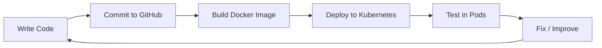

Yes — and not only *can* it be carried out, it’s actually the **correct professional workflow**.
What you’re describing is essentially a **mini Dev + Test + Deploy pipeline**, even if it’s all on your laptop.

Let’s structure it properly so you don’t end up with chaos later.

---

# 🧠 🏗️ Your Workflow (How It Should Work)

You’ll have **two parallel worlds**:

## 1️⃣ Code World (GitHub)

* Source of truth
* Version control
* Documentation
* History of changes

## 2️⃣ Runtime World (Your Mac / K8s)

* Where code actually runs
* Where you test behavior
* Where bugs appear

---

# 🔁 🔥 Development Cycle

This is your loop:



---

# ⚙️ What You’ll Actually Do (Step-by-Step)

## 🟢 Step 1 — Write Code

* Python agent
* eBPF program
* YAML configs

---

## 🟡 Step 2 — Push to GitHub

```bash
git add .
git commit -m "added agent"
git push
```

👉 This keeps your work safe and trackable

---

## 🔵 Step 3 — Build Docker Image

```bash
docker build -t heimdall-agent:latest .
```

👉 This packages your code

---

## 🟣 Step 4 — Load into Kubernetes

If using **minikube**:

```bash
eval $(minikube docker-env)
docker build -t heimdall-agent:latest .
```

👉 Now K8s can use your image

---

## 🟠 Step 5 — Deploy to K8s

```bash
kubectl apply -f agent-daemonset.yaml
```

---

## 🔴 Step 6 — Test

```bash
kubectl get pods
kubectl logs <pod>
kubectl exec -it <pod> -- bash
```

---

# 🧩 Folder Structure (IMPORTANT 🔥)

Keep things clean from day 1:

```id="vwh6h1"
heimdall/
│
├── agent/                # Python + eBPF code
├── ebpf/                 # C programs
├── k8s/                  # YAML files
├── docs/                 # your documentation
├── scripts/              # helper scripts
├── Dockerfile
└── README.md
```

---

# 🧠 Key Insight

> GitHub = **brain (code + history)**
> Kubernetes = **body (execution)**

---

# ⚠️ Common Mistakes (Avoid These)

❌ Editing code directly inside containers
❌ Not rebuilding Docker image after changes
❌ Mixing local files and deployed versions
❌ No versioning → confusion later

---

# 💡 Pro Workflow Upgrade (Later)

Once you’re comfortable:

* Use **Makefile**:

```bash
make build
make deploy
```

* Or simple script:

```bash id="u0p2xg"
./deploy.sh
```

---

# 🚀 What This Enables for You

✔ Real-world DevOps workflow
✔ Easy debugging
✔ Clean project structure
✔ Ready for scaling later

---

# 🧠 My Suggestion

For now keep it simple:

1. Write code
2. Build Docker
3. Deploy to K8s
4. Test
5. Push to GitHub

---

# 🔥 Next Step

Before writing code, we should:

👉 Create:

* GitHub repo structure
* First Dockerfile
* Basic deployment YAML

---

Just say:

> **“setup repo structure + first dockerfile”**

and we’ll start building Heimdall like a real product 🔥
