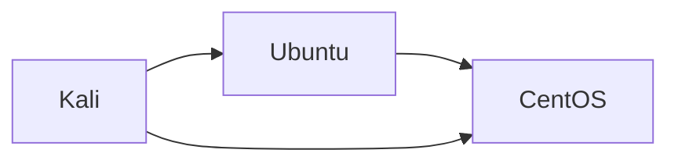

# 🧠 🐳 Podman vs Docker (Quick Context)

* Podman = daemonless (no background service)
* Rootless by default 🔥
* CLI is **almost identical to Docker**

👉 So everything you learned still applies

---

# 🎯 Goal

Run:

* 🐧 Ubuntu → service
* 🐉 CentOS → backend
* 🐱‍💻 Kali → attacker

Connected via a **shared network**

---

# ⚙️ Step 1 — Pull Images

```bash id="5i7t2o"
podman pull docker.io/library/ubuntu
podman pull docker.io/library/alpine:latest
podman pull docker.io/kalilinux/kali-rolling
```

---

# 🌐 Step 2 — Create Network

```bash id="4r4g1v"
podman network create heimdall-net
```

---

# 🐧 Step 3 — Run Ubuntu Container

```bash id="ykdfym"
podman run -dit \
  --name ubuntu-node \
  --network heimdall-net \
  docker.io/library/ubuntu bash
```

---

# 🐉 Step 4 — Run CentOS Container

```bash id="rtu5q7"
podman run -dit \
  --name alpine-node \
  --network heimdall-net \
  docker.io/library/alpine sh
```

---

# 🐱‍💻 Step 5 — Run Kali Container

```bash id="3k9jmu"
podman run -dit \
  --name kali-node \
  --network heimdall-net \
  docker.io/kalilinux/kali-rolling bash
```

---

# 🔍 Step 6 — Verify

```bash id="u8i6on"
podman ps
```

---

# 🔗 Step 7 — Test Connectivity

Enter Kali:

```bash id="5mmq03"
podman exec -it kali-node bash
```

Then:

```bash id="1tbwup"
ping ubuntu-node
ping alpine-node
```

---

# ⚠️ If Ping Missing

Inside containers:

### Kali / Ubuntu:

```bash id="85h3kn"
apt update && apt install iputils-ping -y
```

### CentOS:

```bash id="rt8z8q"
yum install iputils -y
```

---

# 🧠 Your Current Topology



---

# 🔥 Optional: Add Service on Ubuntu

Inside Ubuntu:

```bash id="mddfa3"
apt update && apt install python3 -y
python3 -m http.server 80
```

From Kali:

```bash id="3v0l7z"
curl ubuntu-node
```

---

# 🧠 Why Podman is Great for You

✔ No daemon → closer to Kubernetes model
✔ Rootless → safer
✔ Compatible with K8s YAML (later via `podman generate kube`)

---

# ⚔️ Next Step (VERY POWERFUL)

Podman has a killer feature:

```bash id="jzjvhy"
podman generate kube <container>
```

👉 This can convert your containers → Kubernetes YAML

---

# 🚀 Where We Go Next

Now you have:

✔ Working container network
✔ Attack simulation base

Next we can:

### 🔹 Option 1 (Recommended)

👉 Convert to Kubernetes manually (better learning)

### 🔹 Option 2

👉 Auto-generate YAML using Podman

---

# 💡 My Recommendation

Go manual → you’ll understand K8s deeply

---

# 🚀 Next Step

Say:

> **“convert podman setup to k8s manually”**

and I’ll:

* write clean YAML
* map namespaces
* test connectivity in cluster

We’re building Heimdall the right way 🔥
